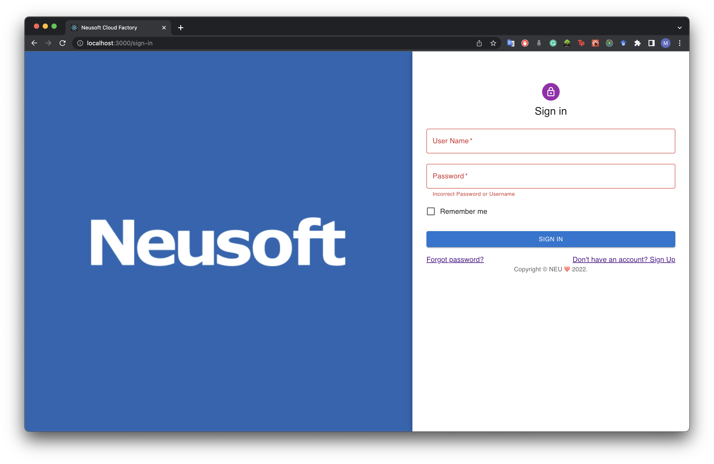
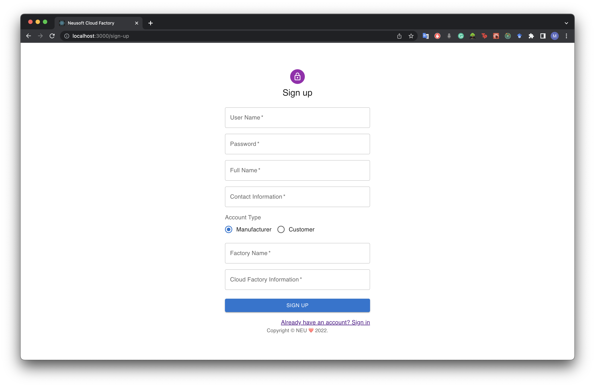
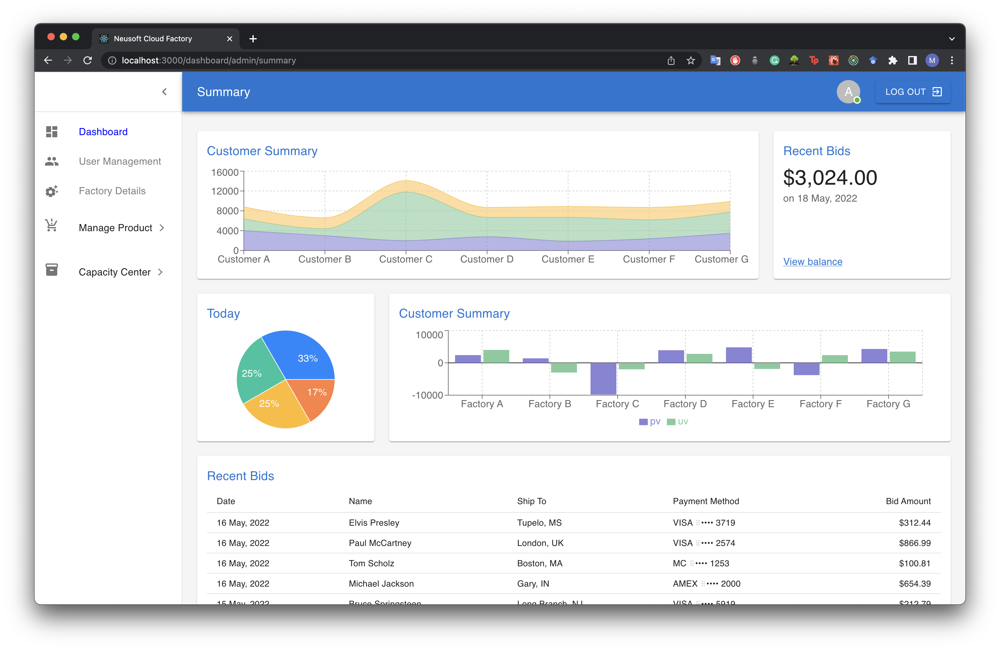
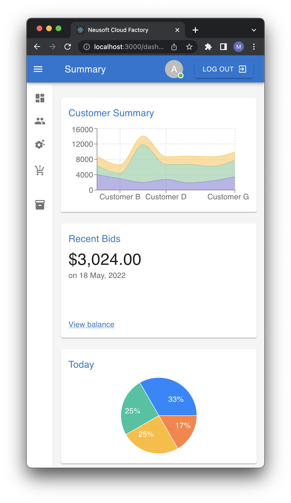

# Installations Instructions

#### Create a folder with the same file structure and then CD into it.

##### use the following commands in your terminal to install and run the project

```bash
npm install
```

```bash
npm start
```

## Information

#### I made this website as a project for my Human-Computer Interaction Design Class. 

Showing all parts of this project in this README file would take up a lot of space, so I'll narrow it down to a few details. 

- This App was made using ReactJS, Material UI and Recharts
- The website is completely responsive to all layouts
- It can be successfully used with a screen-reader and for the same reason, web crawlers will also find it easy to index.

#### Project Summary

The platform has three types of users.

1. **Factory manufacturers** can use this website as a platform to sell their merchandise and organize and manage their business. 
2. **Customer**, who can also be called a middle man. can use this platform to place orders on products made by the Factories. They can choose which manufacturer to choose from depending on their own goals, such as profit margin or product quality. 
3. The **Administrator** has complete control over the entire platform and can view all activities done by customers and manufacturers such as the bid on products. He has the ability to delete users or manufacturers based on their activities, he can also control the current orders.


### Landing Page


### Sign In page 



### Sign Up Page



### Admin Summary Dashboard



### Reponsive Mobile Size


